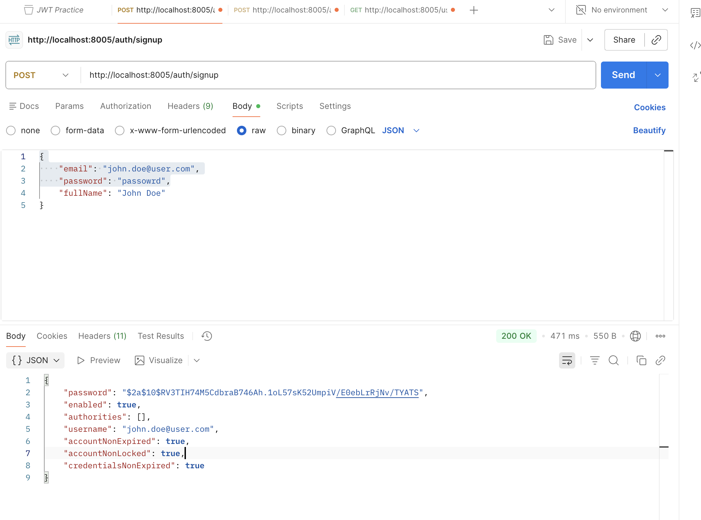
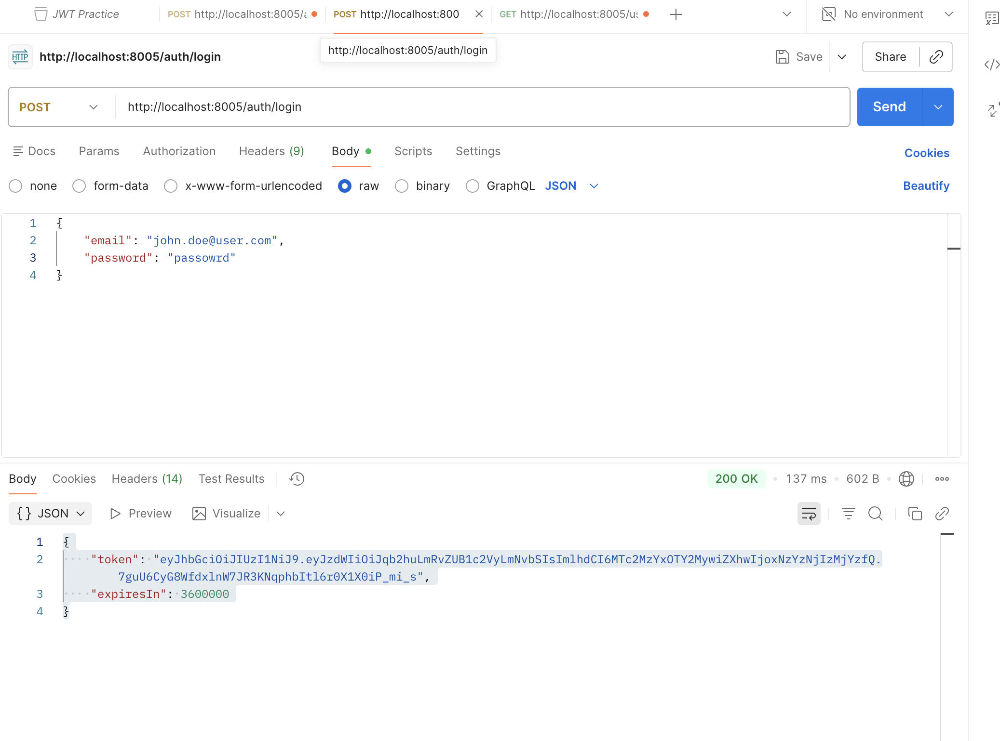
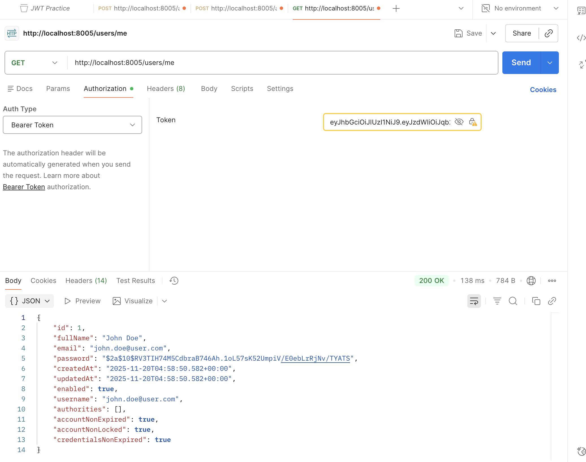
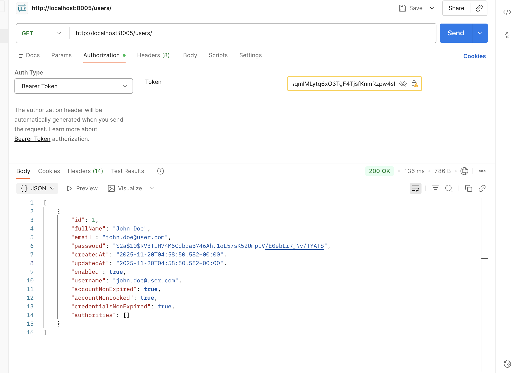
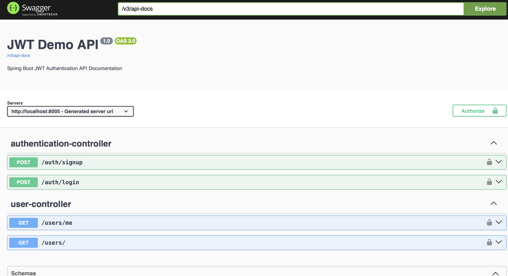

# JWT Demo – Spring Boot Authentication API

A simple and clean Spring Boot 3.3.x JWT Authentication demo that provides:
* User Registration
* User Login (JWT Token generation)
* Authenticated User Profile (/users/me)
* Protected routes using JWT
* Global exception handling
* Swagger (OpenAPI 3) documentation
* MySQL + JPA integration

## Features

### JWT Authentication
* Issue JWT tokens on login
* Stateless authentication using OncePerRequestFilter
* Token validation (expiration, signature, format)

### User Management
* Register new users
* Login with email + password
* Fetch authenticated user details
 
### Security
* Uses Spring Security 6
* Custom JWT authentication filter
* Global exception handler for JWT + Security errors

### API Documentation

Swagger UI available at:
```commandline
http://localhost:8005/swagger-ui/index.html
```
Raw OpenAPI JSON:
```commandline
http://localhost:8005/v3/api-docs
```

## Tech stack
| Component                   | Version |
|-----------------------------|---------|
| Spring Boot                 | 3.3.3   | 
| Spring Security             | 6.x     | 
| Spring Web                  |         | 
| Spring Data JPA             |         | 
| My SQL                      | 8+      |
| JWT (JJWT)                  | 0.11.5  |
| Swagger (springdoc-openapi) | 2.5.0   |
| Java API                    | 17      |

## Setup instructions

### Clone the project
```commandline
git clone https://github.com/sujaybn/JwtDemo.git
cd JwtDemo
```

### Configure My SQL
Create a DB:
```commandline
CREATE DATABASE jwt_demo;
``` 

Configure application.properties:
```commandline
spring.datasource.url=jdbc:mysql://localhost:3306/jwt_demo
spring.datasource.username=root
spring.datasource.password=yourpassword

spring.jpa.hibernate.ddl-auto=update
```

### Run the project:
```commandline
mvn spring-boot:run
```
Server starts at:

```commandline
http://localhost:8005
```

### Authentication Flow
#### POST /auth/signup

```json
{
  "email": "test@example.com",
  "password": "mypassword",
  "fullName": "John Doe"
}
```

### Login

#### POST /auth/login

Response:
```json lines
{
  "token": "jwt_token_here",
  "expiresIn": 3600000
}
```

###  Use JWT

All protected endpoints require:
```commandline
Authorization: Bearer <token>
```

### Get Authenticated User

#### GET /users/me

##### Public

| Method | Endpoint     | Description           |
|--------|--------------|-----------------------|
| POST   | /auth/signup | Register new user     | 
| POST   | /auth/login  | Login and receive JWT | 

##### Protected

| Method | Endpoint  | Description            |
|--------|-----------|------------------------|
| GET    | /users/me | Get authenticated user | 
| GET    | /users    | List all users         | 


## Global Error Handling

Handled exceptions include:
* BadCredentialsException
* ExpiredJwtException
* SignatureException
* AccountStatusException
* AccessDeniedException
* Unknown 500 errors

Responses follow RFC 7807 ProblemDetail format.

Example:
```json
{
  "type": "about:blank",
  "title": "Unauthorized",
  "status": 401,
  "detail": "Bad credentials",
  "description": "The username or password is incorrect"
}
```

## OpenAPI Definition
Automatically generated and available at:

```commandline
/v3/api-docs
```

## Project structure
```text
src/main/java/com/jwt/
├── config/            # Security + JWT config
├── controller/        # REST controllers
├── dto/               # Request/Response DTOs
├── entity/            # JPA Entities
├── exception/         # Global exception handler
├── filter/            # JWT filter
├── repository/        # DB repositories
├── service/           # Business logic
```

## Testing evidence from local

#### Register user

#### Login user

#### Get current user

#### Get all users

#### Swagger documentation local



## Summary

This project demonstrates a full working example of JWT authentication with Spring Boot, complete with:
* Secure endpoints
* Token validation
* MySQL persistence
* Clean architecture
* Swagger documentation
* Proper exception handling
